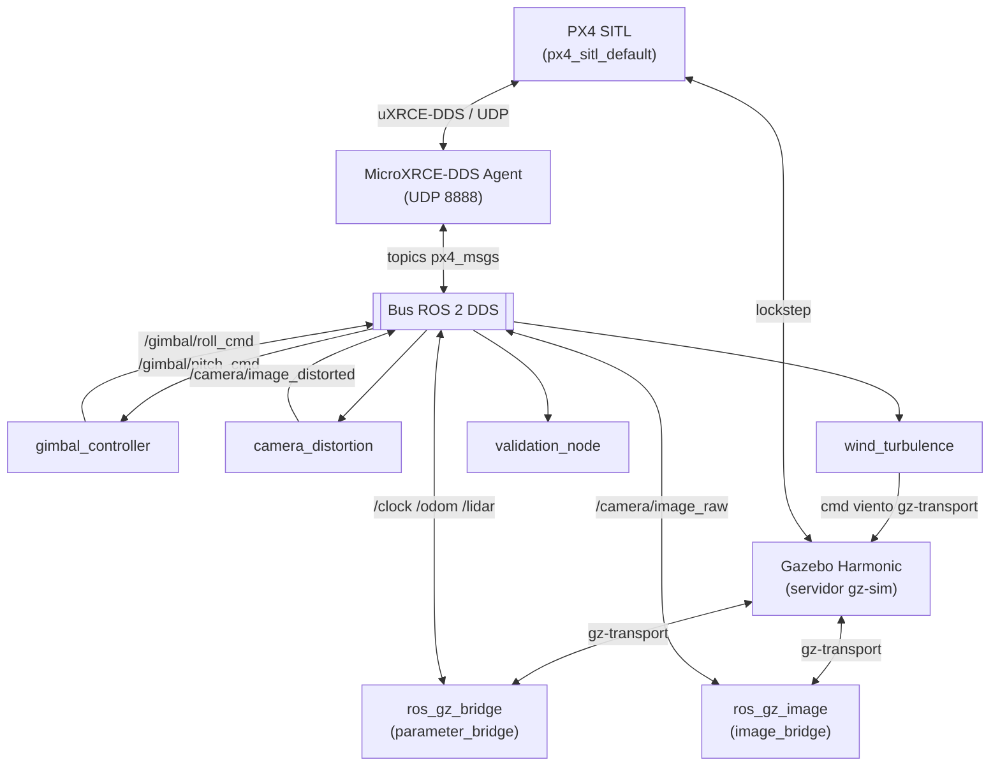
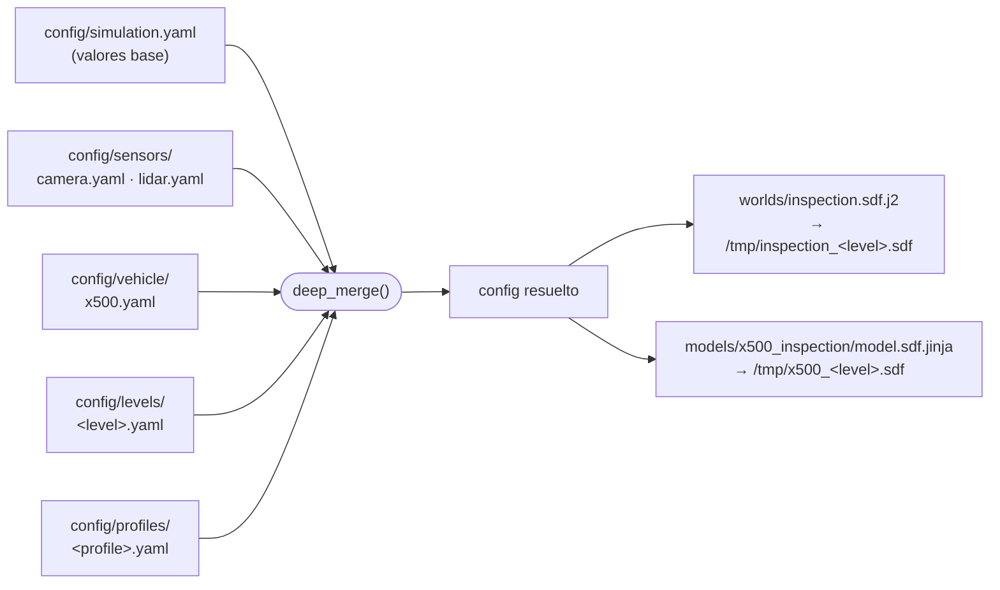

# alerion_sim

[](https://docs.ros.org/en/jazzy/)
[](https://gazebosim.org/docs/harmonic/)
[](https://docs.px4.io/main/en/)


Framework de simulación para validación de inspección autónoma con drones.
Integra PX4 SITL, Gazebo Harmonic y ROS 2 Jazzy en un único launch parametrizado,
con tres niveles de fidelidad y perfiles de sensores intercambiables. Gestionado
por un sistema de configuración YAML con deep-merge en capas.

---

## Índice

- [Inicio rápido](#inicio-rápido)
- [QGroundControl](#qgroundcontrol)
- [Niveles de fidelidad](#niveles-de-fidelidad)
- [Arquitectura](#arquitectura)
- [Sistema de configuración](#sistema-de-configuración)
- [Ejecución sin Docker](#ejecución-sin-docker)
- [Solución de problemas](#solución-de-problemas)

---

## Inicio rápido

> Requisitos: Docker, GPU AMD/NVIDIA y un árbol PX4-Autopilot compilado en el host.  
> Instrucciones completas de instalación: [INSTALL.md](INSTALL.md)

```bash
# 1  Permitir al contenedor acceder a la pantalla del host
xhost +local:docker

# 2  Construir la imagen (solo la primera vez)
cd ~/Desktop/alerion_sim/alerion_sim
docker compose -f docker/docker-compose.yml build

# 3  Lanzar
docker compose -f docker/docker-compose.yml run --rm sim level:=full
```

Otros comandos útiles:

```bash
# Nivel development  sin ruido, sin distorsión, gimbal instantáneo
docker compose -f docker/docker-compose.yml run --rm sim level:=development

# Development con perfil de visión
docker compose -f docker/docker-compose.yml run --rm sim \
    level:=development sensor_profile:=vision

# QGroundControl (en un segundo terminal mientras la sim está activa)
docker compose -f docker/docker-compose.yml run --rm qgc

# Nodo de validación (en un segundo terminal mientras la sim está activa)
docker compose -f docker/docker-compose.yml run --rm validate
```

---

## QGroundControl

QGroundControl (v4.4.4) está incluido en la imagen Docker. Se ejecuta como un servicio independiente y se conecta automáticamente a PX4 SITL a través de MAVLink UDP 14550 en cuanto la simulación está activa.

### Lanzar QGC

```bash
# 1  Permitir acceso a la pantalla del host (necesario una sola vez por sesión X)
xhost +local:docker

# 2  En un terminal, lanzar la simulación
docker compose -f docker/docker-compose.yml run --rm sim level:=full

# 3  En un segundo terminal, lanzar QGC
docker compose -f docker/docker-compose.yml run --rm qgc
```

QGC detecta el vehículo automáticamente al conectarse (icono verde en la barra superior). No requiere ninguna configuración de enlace adicional si la simulación se lanzó antes.

### Guardar misiones entre sesiones

Los parámetros y misiones guardadas en QGC se persisten en el volumen Docker `qgc_settings`. El volumen sobrevive a `docker compose down`; solo se elimina con:

```bash
docker volume rm alerion_sim_qgc_settings
```

---

## Niveles de fidelidad

| Nivel | Física | Renderizado | Cámara | LiDAR | Viento | Ruido |
|---|---|---|---|---|---|---|
| `minimal` | ODE 250 Hz | headless | ✗ | ✗ | ✗ | ✗ |
| `development` | ODE 250 Hz | ogre2, sin sombras | 640×480 @ 30 Hz | 16 haces 15 Hz | ✗ | ✗ |
| `full` | ODE 250 Hz | ogre2 PBR + sombras | 1280×720 @ 30 Hz | 32 haces 20 Hz | Gaussiano | ✓ |

**Perfiles de sensores** (se aplican sobre cualquier nivel):

| Perfil | Cámara | LiDAR |
|---|---|---|
| `navigation` *(por defecto)* | ✗ | ✓ |
| `vision` | ✓ | ✗ |
| `hard_vision` | 1280×720, distorsión, gimbal realista | ✗ |

---

## Arquitectura

### Topología de procesos



### Secuencia de arranque

```
t = 0 s   Agente MicroXRCE-DDS  (solo development / full)
t = 0 s   Servidor Gazebo  (mundo renderizado desde plantilla Jinja2)
t = 3 s   ros_gz_sim spawn  →  modelo x500_0 insertado en el mundo
t = 6 s   PX4 SITL  →  conecta con gz_x500 / x500_0
t = 6 s   ros_gz_bridge + image_bridge  →  topics puenteados a ROS 2
t = 6 s   gimbal_controller, camera_distortion, wind_turbulence  (si están activos)
```

---

## Sistema de configuración

El launch file resuelve la configuración final mediante un **deep-merge por capas** en tiempo de ejecución. Las capas posteriores sobreescriben claves individuales; las claves no definidas se heredan de capas anteriores.



**Archivos de configuración principales:**

| Archivo | Propósito |
|---|---|
| `config/simulation.yaml` | Valores base: nombre del vehículo, pose de spawn, puerto DDS, instancia PX4 |
| `config/levels/minimal.yaml` | Headless, sin sensores salvo IMU/GPS/barómetro |
| `config/levels/development.yaml` | Fidelidad media, sin ruido, gimbal instantáneo |
| `config/levels/full.yaml` | Alta fidelidad: PBR, ruido, viento, gimbal realista, distorsión de lente |
| `config/sensors/camera.yaml` | Intrínsecos de cámara, tasa de actualización, planos de recorte |
| `config/sensors/lidar.yaml` | Geometría de escaneo LiDAR, tasa de actualización |
| `config/vehicle/x500.yaml` | Masa del chasis, disposición de motores, geometría del gimbal |
| `config/profiles/hard_vision.yaml` | Sobreescritura de cámara HD + distorsión completa |

Cualquier clave de una capa más profunda prevalece silenciosamente sobre la misma clave en capas anteriores  sin necesidad de duplicar valores.

---

## Ejecución sin Docker

### Prerequisitos

```bash
# Paquetes del sistema
sudo apt update && sudo apt install -y \
    git curl wget build-essential cmake ninja-build \
    python3-pip python3-venv \
    xorg openbox x11-xserver-utils

# ROS 2 Jazzy
sudo curl -sSL https://raw.githubusercontent.com/ros/rosdistro/master/ros.key \
    -o /usr/share/keyrings/ros-archive-keyring.gpg
echo "deb [arch=$(dpkg --print-architecture) signed-by=/usr/share/keyrings/ros-archive-keyring.gpg] \
    http://packages.ros.org/ros2/ubuntu $(. /etc/os-release && echo $UBUNTU_CODENAME) main" \
    | sudo tee /etc/apt/sources.list.d/ros2.list
sudo apt update && sudo apt install -y ros-jazzy-desktop

# Gazebo Harmonic + puentes ROS 2
sudo apt install -y \
    gz-harmonic \
    ros-jazzy-ros-gz-bridge ros-jazzy-ros-gz-sim ros-jazzy-ros-gz-image \
    ros-jazzy-nav-msgs ros-jazzy-sensor-msgs \
    python3-gz-transport13 python3-gz-msgs10
```

### PX4

```bash
git clone --recursive https://github.com/PX4/PX4-Autopilot.git ~/Desktop/PX4-Autopilot
cd ~/Desktop/PX4-Autopilot

# Instala el toolchain y las dependencias Python
# (gestiona automáticamente externally-managed-environment en Ubuntu 24.04)
bash Tools/setup/ubuntu.sh --no-nuttx
make px4_sitl_default
```

### px4_msgs y agente MicroXRCE-DDS

```bash
# px4_msgs (fijado a release/1.15)
mkdir -p ~/px4_msgs_ws/src
git clone --depth 1 --branch release/1.15 \
    https://github.com/PX4/px4_msgs.git ~/px4_msgs_ws/src/px4_msgs
source /opt/ros/jazzy/setup.bash
colcon build --base-paths ~/px4_msgs_ws/src \
             --install-base ~/px4_msgs_ws/install \
             --cmake-args -DCMAKE_BUILD_TYPE=Release
echo "source ~/px4_msgs_ws/install/setup.bash" >> ~/.bashrc

# Agente MicroXRCE-DDS
git clone https://github.com/eProsima/Micro-XRCE-DDS-Agent.git ~/Micro-XRCE-DDS-Agent
cd ~/Micro-XRCE-DDS-Agent
cmake -B build -DUXRCE_BUILD_EXAMPLES=OFF
cmake --build build -j$(nproc)
sudo cmake --install build && sudo ldconfig /usr/local/lib/
```

### Compilar y lanzar

```bash
cd ~/Desktop/alerion_sim
colcon build --symlink-install --packages-select alerion_sim
source install/setup.bash
echo "source ~/Desktop/alerion_sim/install/setup.bash" >> ~/.bashrc

export PX4_DIR=~/Desktop/PX4-Autopilot
ros2 launch alerion_sim simulation.launch.py level:=full
```

---

## Solución de problemas

### Gazebo no muestra ventana

```bash
xhost +local:docker
export DISPLAY=:0
```

### RTF bajo (< 50 %) / errores de timestamp en IMU

Síntoma: `ERROR [vehicle_imu] timestamp error timestamp_sample: X, previous: Y`

El motor de física no puede mantener el tiempo real. `full.yaml` ya está configurado
a 250 Hz (`max_step_size: 0.004`). Si el problema persiste, reduce la tasa de
actualización de la cámara o el LiDAR en el YAML del nivel, o cambia a `level:=development`.

### Topics de cámara vacíos / incompatibilidad QoS

`ros_gz_image` publica con fiabilidad `BEST_EFFORT`. Cualquier suscriptor que use
el perfil por defecto `RELIABLE` no recibirá nada silenciosamente. El nodo
`camera_distortion` ya tiene el perfil correcto configurado.

### Errores de mallas de Gazebo (`model://x500_base/meshes/...`)

El launch file establece `GZ_SIM_RESOURCE_PATH` automáticamente desde `PX4_DIR`.
Verifica que `PX4_DIR` apunta a un árbol PX4 completamente compilado:

```bash
ls $PX4_DIR/build/px4_sitl_default/bin/px4
```

### `Could not find package alerion_sim`

Ejecuta `colcon build` desde la raíz del workspace y carga el install:

```bash
cd ~/Desktop/alerion_sim
colcon build --symlink-install --packages-select alerion_sim
source install/setup.bash
```

### Docker  `Unable to find group render`

Los nombres en `group_add` se resuelven dentro del contenedor. Usa GIDs numéricos:

```bash
getent group video render   # muestra los GIDs en tu host
```

Luego configúralos en `docker/docker-compose.yml`:

```yaml
group_add:
  - "44"    # video
  - "992"   # render  ← reemplaza con el GID de tu host si es diferente
```
