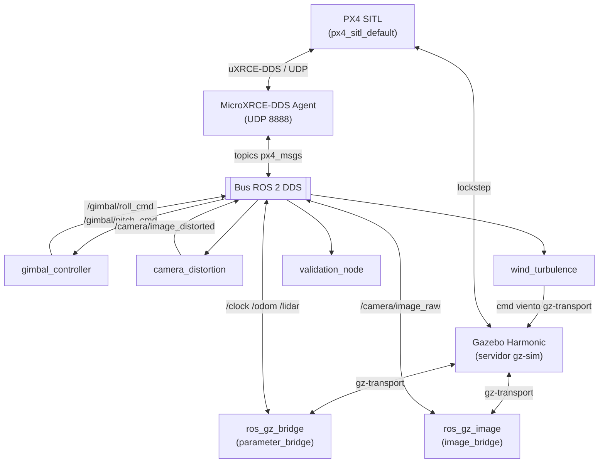

# alerion_sim

[](https://docs.ros.org/en/jazzy/)
[](https://gazebosim.org/docs/harmonic/)
[](https://docs.px4.io/main/en/)


Framework de simulación para validación de inspección autónoma con drones.
Integra PX4 SITL, Gazebo Harmonic y ROS 2 Jazzy en un único launch parametrizado,
con tres niveles de fidelidad y perfiles de sensores intercambiables. Gestionado
por un sistema de configuración YAML con deep-merge en capas.

---

## Índice

- [Inicio rápido](#inicio-rápido)
- [QGroundControl](#qgroundcontrol)
- [Nodo de validación](#nodo-de-validación)
- [Visualización RViz](#visualización-rviz)
- [Niveles de fidelidad](#niveles-de-fidelidad)
- [Arquitectura](#arquitectura)
- [Sistema de configuración](#sistema-de-configuración)
- [Ejecución sin Docker](#ejecución-sin-docker)
- [Solución de problemas](#solución-de-problemas)

---

## Inicio rápido

> Requisitos: Docker, GPU AMD/NVIDIA y un árbol PX4-Autopilot compilado en el host.  
> Instrucciones completas de instalación: [INSTALL.md](INSTALL.md)

```bash
# 1  Permitir al contenedor acceder a la pantalla del host
xhost +local:docker

# 2  Construir la imagen (solo la primera vez)
cd ~/Desktop/alerion_sim/alerion_sim/docker
docker compose build

# 3  Lanzar (AMD por defecto; para NVIDIA ver sección "Selección de GPU")
docker compose run --rm sim level:=full
```

> Todos los comandos `docker compose` se ejecutan desde `alerion_sim/docker/`.
> Sin `-f` explícito, Compose carga automáticamente `docker-compose.override.yml`
> con la configuración AMD. NVIDIA requiere `-f` explícito (ver más abajo).

Otros comandos útiles:

```bash
# Nivel development  sin ruido, sin distorsión, gimbal instantáneo
docker compose run --rm sim level:=development

# Development con perfil de visión
docker compose run --rm sim level:=development profile:=vision

# QGroundControl (en un segundo terminal mientras la sim está activa)
docker compose run --rm qgc

# Visualización RViz (en un segundo terminal mientras la sim está activa)
docker compose run --rm rviz level:=full

# Nodo de validación (en un segundo terminal mientras la sim está activa)
# Pasa el mismo level y profile que la simulación en curso
docker compose run --rm validate level:=full
```

---

## Selección de GPU

El sistema soporta GPUs **AMD** (por defecto) y **NVIDIA** mediante archivos de
overlay de Docker Compose. La configuración base (`docker-compose.yml`) es
agnóstica al hardware; los detalles de cada GPU viven en archivos separados.

Todos los comandos se ejecutan desde `alerion_sim/docker/`.

| GPU | Comando |
|---|---|
| **AMD** (por defecto) | `docker compose run --rm sim level:=full` |
| **NVIDIA** | `docker compose -f docker-compose.yml -f docker-compose.nvidia.yml run --rm sim level:=full` |

> **Por qué AMD no necesita `-f`:**
> Docker Compose auto-carga `docker-compose.override.yml` cuando no se pasa ningún
> `-f` explícito. El override contiene toda la configuración AMD (`DRI_PRIME`,
> `/dev/dri`, `group_add`). En cuanto se usa `-f`, el override deja de cargarse
> automáticamente — por eso NVIDIA pasa los dos archivos de forma explícita y el
> override AMD no interfiere.

Los archivos de override modifican únicamente las secciones específicas de GPU:
`environment`, `devices`, `group_add` (AMD) o `deploy.resources` (NVIDIA).
El resto de la configuración (red, volúmenes, entrypoints) se hereda del archivo
base.

```bash
# Ejemplo: lanzar con NVIDIA (desde alerion_sim/docker/)
docker compose -f docker-compose.yml -f docker-compose.nvidia.yml \
    run --rm sim level:=full
```

---

## QGroundControl

QGroundControl (v4.4.4) está incluido en la imagen Docker. Se ejecuta como un servicio independiente y se conecta automáticamente a PX4 SITL a través de MAVLink UDP 14550 en cuanto la simulación está activa.

### Lanzar QGC

```bash
# Desde alerion_sim/docker/

# 1  Permitir acceso a la pantalla del host (necesario una sola vez por sesión X)
xhost +local:docker

# 2  En un terminal, lanzar la simulación (AMD)
docker compose run --rm sim level:=full

# 3  En un segundo terminal, lanzar QGC (AMD)
docker compose run --rm qgc

# Con NVIDIA: pasar ambos archivos explícitamente en ambos terminales
docker compose -f docker-compose.yml -f docker-compose.nvidia.yml run --rm sim level:=full
docker compose -f docker-compose.yml -f docker-compose.nvidia.yml run --rm qgc
```

QGC detecta el vehículo automáticamente al conectarse (icono verde en la barra superior). No requiere ninguna configuración de enlace adicional si la simulación se lanzó antes.

### Guardar misiones entre sesiones

Los parámetros y misiones guardadas en QGC se persisten en el volumen Docker `qgc_settings`. El volumen sobrevive a `docker compose down`; solo se elimina con:

```bash
docker volume rm alerion_sim_qgc_settings
```

---

## Nodo de validación

El nodo de validación monitoriza pasivamente una sesión de vuelo en curso.
Se ejecuta en un terminal independiente junto a la simulación y produce:

- **Estado cada 10 s** — RTF, CPU y RAM por proceso, topics activos/caídos.
- **CSV de carga computacional** — una fila por muestra con RTF, CPU y RAM de cada proceso relevante.
- **Informe final** — resumen de topics al detener el nodo (`Ctrl+C`).

### Lanzar

```bash
# Con Docker (AMD) — desde alerion_sim/docker/:
docker compose run --rm validate level:=full

# Con Docker (NVIDIA) — desde alerion_sim/docker/:
docker compose -f docker-compose.yml -f docker-compose.nvidia.yml \
    run --rm validate level:=full

# Sin Docker:
ros2 launch alerion_sim validation.launch.py level:=full
```

> `level` y `profile` deben coincidir con la simulación en curso.
> El nodo los usa para calcular exactamente qué topics deben estar activos,
> evitando falsos positivos en el chequeo de salud de topics.

### Parámetros del launch file

| Argumento | Por defecto | Descripción |
|---|---|---|
| `level` | `full` | Nivel de fidelidad de la simulación en curso (`minimal` / `development` / `full`) |
| `profile` | `auto` | Perfil de sensores de la simulación en curso (`auto` / `navigation` / `vision` / `hard_vision`) |
| `model_name` | `x500_0` | Nombre del modelo en Gazebo (debe coincidir con el de la sim) |
| `world_name` | `inspection` | Nombre del mundo Gazebo |
| `status_interval` | `10.0` | Segundos entre impresiones de estado en consola |
| `cpu_sample_hz` | `0.2` | Frecuencia de muestreo de CPU/RAM en Hz (0.2 Hz = cada 5 s) |
| `compute_csv` | `/tmp/alerion_compute.csv` | Ruta de salida del CSV de carga computacional |

Ejemplo con parámetros no por defecto:

```bash
ros2 launch alerion_sim validation.launch.py \
    level:=development \
    profile:=navigation \
    status_interval:=5.0 \
    compute_csv:=/tmp/mi_vuelo.csv
```

### Parámetros avanzados del nodo ROS 2

Configurables en `config/validation.yaml` o sobrescribibles con `--ros-args -p`:

| Parámetro | Por defecto | Descripción |
|---|---|---|
| `target_processes` | `[gz sim, px4, MicroXRCEAgent, ...]` | Patrones de nombre de proceso a monitorizar (regex) |
| `expected_topics` | *(calculado por el launch file)* | Lista de topics que deben estar activos; se comprueba cada `status_interval` segundos |

> `expected_topics` se calcula automáticamente a partir de `level` y `profile`:
> el nodo sólo espera los topics que los bridges y controladores activos realmente publican.
> Sobreescribirlo manualmente sólo es necesario si el nodo se inicia fuera del launch file.

### Salida de ejemplo

```
----------------------------------------------------
  t=20s   RTF=0.97
----------------------------------------------------
  SYSTEM    cpu= 91.4%   mem=  7203 MB
  gz sim    cpu= 44.2%   mem=  1318 MB
  px4       cpu=  9.1%   mem=   304 MB
  xrce      cpu=  3.4%   mem=    91 MB
  bridge    cpu=  2.0%   mem=    74 MB
  gimbal    cpu=  0.5%   mem=    46 MB
----------------------------------------------------
  TOPICS  8/8 UP   all OK
----------------------------------------------------
```

---

## Visualización RViz

RViz2 permite monitorizar la simulación en tiempo real desde el host mientras el
contenedor Docker corre. Hay tres configuraciones precargadas — una por nivel de
fidelidad — que activan automáticamente los displays relevantes para la combinación
de nivel y perfil de sensores en uso.

RViz corre en su propio contenedor con acceso a la GPU, igual que `sim` y `qgc`.
No requiere ROS 2 instalado en el host.

### Lanzar

```bash
# Desde alerion_sim/docker/ — en un terminal separado mientras la sim está activa

# AMD (override.yml se carga automáticamente)
docker compose run --rm rviz level:=full
docker compose run --rm rviz level:=development
docker compose run --rm rviz level:=minimal

# NVIDIA
docker compose -f docker-compose.yml -f docker-compose.nvidia.yml run --rm rviz level:=full
```

> `level` debe coincidir con el nivel de la simulación en curso.
> La configuración `.rviz` se elige automáticamente según el argumento.

### Diferencias visuales por nivel

Cada config está diseñada para que la diferencia de fidelidad sea **inmediatamente
visible** al cambiar de nivel.

| Elemento | `minimal` | `development` | `full` |
|---|:---:|:---:|:---:|
| Fondo | Gris oscuro | Azul marino | Azul noche |
| Trayectoria de vuelo (línea verde) | ✓ | ✓ | ✓ |
| Flecha de velocidad (verde→rojo) | ✗ | ✓ | ✓ |
| Anillo LiDAR 2-D (`/lidar`) | ✗ | ✓ naranja | ✓ naranja |
| Nube de puntos 3-D (`/lidar/points`) | ✗ | 1 440 pts/scan · sin ruido | 2 880 pts/scan · con ruido |
| Color de nube | — | Arcoíris por Z | Arcoíris por Z |
| Imagen cámara raw | ✗ | ✓ 640×480 | ✓ 1 280×720 |
| Imagen cámara distorsionada | ✗ | ✗ | ✓ (k₁=−0.45) |
| Flecha de viento (cian) | ✗ | ✗ | ✓ |
| Árbol TF con nombres | ✗ | ✗ | ✓ |

### Elementos visuales

| Display | Topic | Descripción |
|---|---|---|
| **Flight Path** | `/drone/path` | Línea verde continua con todas las posiciones visitadas. Se acumula durante el vuelo. Se limpia al reiniciar la simulación. |
| **Velocity** | `/drone/velocity_marker` | Flecha publicada en el frame del dron (`x500_0/base_footprint`). Longitud proporcional a la velocidad (0.4 m por m/s). Color: verde (parado) → amarillo → rojo (≥ 5 m/s). |
| **LiDAR Scan** | `/lidar` | Anillo 2-D naranja: los 90 rayos del arco horizontal de 90° en el plano de vuelo actual. |
| **LiDAR Points** | `/lidar/points` | Nube 3-D con `Decay Time = 3 s`: los retornos de las últimas ~60 scans se acumulan formando un mapa del entorno. El gradiente arcoíris muestra la elevación (azul = suelo, rojo = altura máxima). |
| **Camera Raw** | `/camera/image_raw` | Feed de la cámara con gimbal en tiempo real. |
| **Camera Distorted** | `/camera/image_distorted` | Feed con distorsión de barril aplicada (solo nivel `full`). Comparar con Raw muestra el efecto del modelo de lente. |
| **Wind** | `/wind/marker` | Flecha cian en la posición del dron. Longitud y dirección = vector de viento instantáneo (media + turbulencia Dryden). La flecha "respira" con las ráfagas. Solo activo en `full`. |
| **TF** | `/tf` `/tf_static` | Árbol de transformaciones: `x500_0/odom → x500_0/base_footprint → lidar_sensor_link / x500_0/camera_link`. Muestra la orientación real del dron y la posición de cada sensor. |

### Seguimiento automático del dron

La vista está configurada con `Target Frame: x500_0/base_footprint`, por lo que
el centro de la cámara orbita alrededor del dron automáticamente sin perderlo de
vista. Se puede rotar, hacer zoom y trasladar la vista con normalidad; el centro
vuelve a seguir al dron en el siguiente frame.

Para cambiar el modo de cámara: panel **Views** → cambiar `Class` a `Orbit`
(cámara libre) o `ThirdPersonFollower` (seguimiento automático).

### Topics publicados por la simulación para RViz

Además de los topics de sensores, la simulación arranca automáticamente nodos
auxiliares que generan datos específicos para visualización:

| Topic | Tipo | Publicado por |
|---|---|---|
| `/drone/path` | `nav_msgs/Path` | `drone_visualizer` — acumula poses de odometría (máx. 3 000 puntos, distancia mínima 0.1 m) |
| `/drone/velocity_marker` | `visualization_msgs/Marker` | `drone_visualizer` — flecha de velocidad codificada por color |
| `/wind/vector` | `geometry_msgs/Vector3Stamped` | `wind_turbulence` — vector de viento en bruto (útil para rosbag) |
| `/wind/marker` | `visualization_msgs/Marker` | `wind_turbulence` — flecha de viento cian para RViz |

### Árbol TF y Fixed Frame

El Fixed Frame configurado en los tres archivos `.rviz` es `x500_0/odom`.
La cadena de transformaciones completa es:

```
x500_0/odom  (fijo en el mundo)
  └── x500_0/base_footprint  (posición del dron, dinámica — drone_visualizer)
        ├── lidar_sensor_link  (offset fijo: z = 0.08 m — tf_static)
        └── x500_0/camera_link  (offset fijo: x = 0.10 m, z = 0.05 m — tf_static)
```

Si RViz muestra `Fixed Frame [x500_0/odom] does not exist`, el nodo `drone_visualizer`
aún no ha recibido el primer mensaje de odometría (el dron tarda ~6 s en spawnearse).
Espera unos segundos y se resuelve solo.

---

## Niveles de fidelidad

| Nivel | Física | Renderizado | Cámara | LiDAR | Viento | Ruido |
|---|---|---|---|---|---|---|
| `minimal` | ODE 250 Hz | headless | ✗ | ✗ | ✗ | ✗ |
| `development` | ODE 250 Hz | ogre2, sin sombras | 640×480 @ 30 Hz | 16 haces 15 Hz | ✗ | ✗ |
| `full` | ODE 250 Hz | ogre2 PBR + sombras | 1280×720 @ 30 Hz | 32 haces 20 Hz | Gaussiano | ✓ |

**Perfiles de sensores** (se aplican sobre cualquier nivel):

| Perfil | Cámara | LiDAR |
|---|---|---|
| `navigation` *(por defecto)* | ✗ | ✓ |
| `vision` | ✓ | ✗ |
| `hard_vision` | 1280×720, distorsión, gimbal realista | ✗ |

---

## Arquitectura

### Topología de procesos



### Secuencia de arranque

```
t = 0 s   Agente MicroXRCE-DDS  (solo development / full)
t = 0 s   Servidor Gazebo  (mundo renderizado desde plantilla Jinja2)
t = 3 s   ros_gz_sim spawn  →  modelo x500_0 insertado en el mundo
t = 6 s   PX4 SITL  →  conecta con gz_x500 / x500_0
t = 6 s   ros_gz_bridge + image_bridge  →  topics puenteados a ROS 2
t = 6 s   gimbal_controller, camera_distortion, wind_turbulence  (si están activos)
```

---

## Sistema de configuración

El launch file resuelve la configuración final mediante un **deep-merge por capas** en tiempo de ejecución. Las capas posteriores sobreescriben claves individuales; las claves no definidas se heredan de capas anteriores.


**Archivos de configuración principales:**

| Archivo | Propósito |
|---|---|
| `config/simulation.yaml` | Valores base: nombre del vehículo, pose de spawn, puerto DDS, instancia PX4 |
| `config/levels/minimal.yaml` | Headless, sin sensores salvo IMU/GPS/barómetro |
| `config/levels/development.yaml` | Fidelidad media, sin ruido, gimbal instantáneo |
| `config/levels/full.yaml` | Alta fidelidad: PBR, ruido, viento, gimbal realista, distorsión de lente |
| `config/sensors/camera.yaml` | Intrínsecos de cámara, tasa de actualización, planos de recorte |
| `config/sensors/lidar.yaml` | Geometría de escaneo LiDAR, tasa de actualización |
| `config/vehicle/x500.yaml` | Masa del chasis, disposición de motores, geometría del gimbal |
| `config/profiles/hard_vision.yaml` | Sobreescritura de cámara HD + distorsión completa |

Cualquier clave de una capa más profunda prevalece silenciosamente sobre la misma clave en capas anteriores  sin necesidad de duplicar valores.

---

## Ejecución sin Docker

### Prerequisitos

```bash
# Paquetes del sistema
sudo apt update && sudo apt install -y \
    git curl wget build-essential cmake ninja-build \
    python3-pip python3-venv \
    xorg openbox x11-xserver-utils

# ROS 2 Jazzy
sudo curl -sSL https://raw.githubusercontent.com/ros/rosdistro/master/ros.key \
    -o /usr/share/keyrings/ros-archive-keyring.gpg
echo "deb [arch=$(dpkg --print-architecture) signed-by=/usr/share/keyrings/ros-archive-keyring.gpg] \
    http://packages.ros.org/ros2/ubuntu $(. /etc/os-release && echo $UBUNTU_CODENAME) main" \
    | sudo tee /etc/apt/sources.list.d/ros2.list
sudo apt update && sudo apt install -y ros-jazzy-desktop

# Gazebo Harmonic + puentes ROS 2
sudo apt install -y \
    gz-harmonic \
    ros-jazzy-ros-gz-bridge ros-jazzy-ros-gz-sim ros-jazzy-ros-gz-image \
    ros-jazzy-nav-msgs ros-jazzy-sensor-msgs \
    python3-gz-transport13 python3-gz-msgs10
```

### PX4

```bash
git clone --recursive https://github.com/PX4/PX4-Autopilot.git ~/Desktop/PX4-Autopilot
cd ~/Desktop/PX4-Autopilot

# Instala el toolchain y las dependencias Python
# (gestiona automáticamente externally-managed-environment en Ubuntu 24.04)
bash Tools/setup/ubuntu.sh --no-nuttx
make px4_sitl_default
```

### px4_msgs y agente MicroXRCE-DDS

```bash
# px4_msgs (fijado a release/1.15)
mkdir -p ~/px4_msgs_ws/src
git clone --depth 1 --branch release/1.15 \
    https://github.com/PX4/px4_msgs.git ~/px4_msgs_ws/src/px4_msgs
source /opt/ros/jazzy/setup.bash
colcon build --base-paths ~/px4_msgs_ws/src \
             --install-base ~/px4_msgs_ws/install \
             --cmake-args -DCMAKE_BUILD_TYPE=Release
echo "source ~/px4_msgs_ws/install/setup.bash" >> ~/.bashrc

# Agente MicroXRCE-DDS
git clone https://github.com/eProsima/Micro-XRCE-DDS-Agent.git ~/Micro-XRCE-DDS-Agent
cd ~/Micro-XRCE-DDS-Agent
cmake -B build -DUXRCE_BUILD_EXAMPLES=OFF
cmake --build build -j$(nproc)
sudo cmake --install build && sudo ldconfig /usr/local/lib/
```

### Compilar y lanzar

```bash
cd ~/Desktop/alerion_sim
colcon build --symlink-install --packages-select alerion_sim
source install/setup.bash
echo "source ~/Desktop/alerion_sim/install/setup.bash" >> ~/.bashrc

export PX4_DIR=~/Desktop/PX4-Autopilot
ros2 launch alerion_sim simulation.launch.py level:=full
```

---

## Solución de problemas

### Gazebo no muestra ventana

```bash
xhost +local:docker
export DISPLAY=:0
```

### RTF bajo (< 50 %) / errores de timestamp en IMU

Síntoma: `ERROR [vehicle_imu] timestamp error timestamp_sample: X, previous: Y`

El motor de física no puede mantener el tiempo real. `full.yaml` ya está configurado
a 250 Hz (`max_step_size: 0.004`). Si el problema persiste, reduce la tasa de
actualización de la cámara o el LiDAR en el YAML del nivel, o cambia a `level:=development`.

### Topics de cámara vacíos / incompatibilidad QoS

`ros_gz_image` publica con fiabilidad `BEST_EFFORT`. Cualquier suscriptor que use
el perfil por defecto `RELIABLE` no recibirá nada silenciosamente. El nodo
`camera_distortion` ya tiene el perfil correcto configurado.

### Errores de mallas de Gazebo (`model://x500_base/meshes/...`)

El launch file establece `GZ_SIM_RESOURCE_PATH` automáticamente desde `PX4_DIR`.
Verifica que `PX4_DIR` apunta a un árbol PX4 completamente compilado:

```bash
ls $PX4_DIR/build/px4_sitl_default/bin/px4
```

### `Could not find package alerion_sim`

Ejecuta `colcon build` desde la raíz del workspace y carga el install:

```bash
cd ~/Desktop/alerion_sim
colcon build --symlink-install --packages-select alerion_sim
source install/setup.bash
```

### Docker  `Unable to find group render`

Los nombres en `group_add` se resuelven dentro del contenedor. Usa GIDs numéricos:

```bash
getent group video render   # muestra los GIDs en tu host
```

Luego configúralos en `docker/docker-compose.override.yml`:

```yaml
group_add:
  - "44"    # video
  - "992"   # render  ← reemplaza con el GID de tu host si es diferente
```
